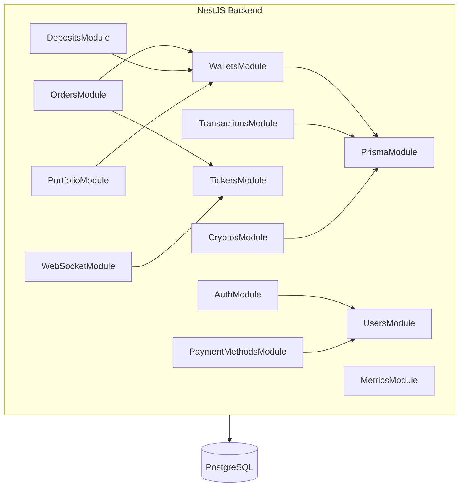
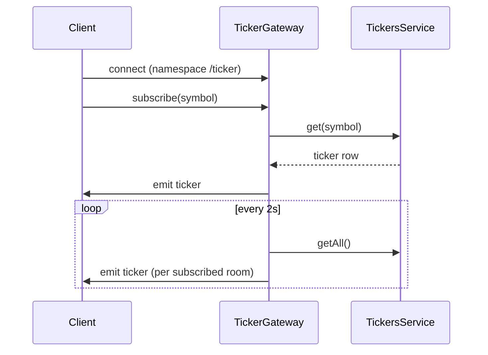

# CryptoSandboxQA — Architecture

A small crypto exchange training platform for QA practice. Simulate trades, validate transactions, and test automation in a safe environment.

## Repository layout

| Path | Role |
|------|------|
| `backend/` | NestJS API, Prisma schema & migrations, seeds |
| `frontend/` | Next.js (App Router) UI |
| `scripts/` | `setup`, database up/down/dump/restore helpers |
| `docs/` | Design notes, static `openapi.json`, [QA testing features](docs/QA_TESTING_FEATURES.md) catalog |
| Root `package.json` | npm workspaces; orchestrates `dev`, DB, OpenAPI generation |

---

## Tech stack

| Layer | Technology |
|-------|------------|
| Backend | NestJS (TypeScript), Prisma ORM |
| Database | PostgreSQL |
| Realtime | Socket.IO (`@nestjs/websockets`, namespace `/ticker`) |
| Frontend | Next.js (React), Zustand (where used), Socket.IO client, **@dnd-kit** (sortable drag-and-drop on dashboard Portfolio Analytics) |
| API docs | Swagger UI + OpenAPI JSON (`/api/docs`, `/api/docs-json`) |
| Metrics | `prom-client` — `GET /metrics` (Prometheus text format) |
| Tooling | npm workspaces, Docker Compose (Postgres + optional observability stack) |

---

## Backend application

`AppModule` wires global `ConfigModule`, `PrismaModule`, and feature modules.



### Feature modules (implemented)

| Module | Responsibility |
|--------|----------------|
| **AuthModule** | Register, register-with-profile, login, logout; JWT + **session** records (`user_sessions`); **2FA** (TOTP setup, enable/disable, verify, backup codes); **admin** bootstrap via `ADMIN_API_KEY` (`POST /auth/admin/register`); **admin-only** `POST /auth/admin/create-user`; **impersonation** (`POST /auth/impersonate`, `POST /auth/end-impersonation`) |
| **UsersModule** | Authenticated user profile CRUD, extended `UserProfile` fields |
| **WalletsModule** | Balances per asset (`user_balances`), training deposit/withdraw via service layer with `balance_transactions` audit |
| **OrdersModule** | Limit/market orders (**spot** and **futures** `marketType` in schema), cancel/list; **MatchingService** (FIFO-style matching, trades). Open orders **lock** funds in `user_balances.balance_locked` (sell: base qty; buy: quote ≈ qty × limit price, or **market buy**: qty × last price at submit, stored on `orders.price` for reservation math); **order_lock** / **order_unlock** in `balance_transactions`. Fills settle via locked funds (`WalletsService.settle*InTx`). |
| **TickersModule** | Last price + 24h volume per trading pair; initial seed on boot |
| **CryptosModule** | Read API for `cryptos` table (market listings / markets UI) |
| **DepositsModule** | **Fiat** and **crypto** deposit flows persisted to `deposits_fiat` / `deposits_crypto`, balance + `balance_transactions` |
| **PaymentMethodsModule** | User payment methods (`user_payment_methods`); used by fiat deposits |
| **PortfolioModule** | Authenticated portfolio: balances, summary, allocation |
| **TransactionsModule** | User-facing transaction history (aggregates deposits, trades, withdrawals as exposed by API) |
| **WebSocketModule** | **TickerGateway** — Socket.IO namespace `/ticker` |
| **MetricsModule** | `GET /metrics` for Prometheus |

**Simulated persistence delay (training):** After validation and **before** the first write, [`OrdersService.create`](backend/src/orders/orders.service.ts) and [`DepositsService`](backend/src/deposits/deposits.service.ts) fiat/crypto deposit methods await [`simulatedPersistDelay`](backend/src/common/simulated-persist-delay.ts) (default **1200** ms, env **`SIMULATED_PERSIST_DELAY_MS`**, `0` to disable). This mimics gateway/settlement lag before rows hit PostgreSQL.

### Admin HTTP API (JWT + admin role)

Admin controllers use the `admin/users` prefix and require an admin-authenticated session (see Swagger tags). Examples:

- `GET /admin/users/:userId/wallets`, wallets by asset
- `GET /admin/users/:userId/orders`, order detail
- `GET /admin/users/:userId/deposits/fiat|crypto` (+ by id)
- `GET /admin/users/:userId/payment-methods` (+ by id)
- `GET /admin/users/:userId/portfolio/*` (balances, summary, allocation)
- `GET /admin/users/:userId/transactions` (+ deposits / trades / withdrawals filters)

---

## Authentication & security (implemented)

- **JWT** bearer tokens for API access, combined with **SessionGuard** backed by `user_sessions` (logout invalidates session).
- **Roles**: `user` | `admin` on `users.role`; `AdminGuard` for admin-only routes.
- **Admin API key**: `ADMIN_API_KEY` + `AdminApiKeyGuard` for bootstrapping admin users (`POST /auth/admin/register`).
- **2FA**: `UserTwoFactor` model; login may return a temp token until `POST /auth/2fa/verify`.
- **Impersonation**: Admin receives tokens to act as target user + `backToAdminToken` to revert (`POST /auth/end-impersonation`).

---

## Database (Prisma)

Full DDL lives in `backend/prisma/schema.prisma`. Detailed narrative: [docs/DATABASE_DESIGN_PROPOSAL.md](docs/DATABASE_DESIGN_PROPOSAL.md).

### Tables in active use

| Area | Models / tables |
|------|-----------------|
| Users & auth | `users`, `user_profiles`, `user_two_factor`, `user_sessions` |
| Payments | `user_payment_methods` |
| Markets | `assets`, `trading_pairs`, `tickers`, `cryptos` |
| Balances | `user_balances`, `balance_transactions` |
| Trading | `orders`, `trades` |
| Funding | `deposits_fiat`, `deposits_crypto`, `withdrawals` |

Orders support `market_type` (`spot` | `futures`) and rich statuses (`open`, `partially_filled`, `filled`, `cancelled`, etc.) aligned with the Prisma schema.

---

## Key services (reference)

| Service | Module | Responsibility |
|---------|--------|----------------|
| **AuthService** | Auth | Credentials, JWT, registration with profile, admin user creation, impersonation |
| **TwoFactorService** | Auth | 2FA lifecycle |
| **SessionsService** | Auth | Session persistence and revocation |
| **UsersService** | Users | User + profile persistence |
| **WalletsService** | Wallets | Balances, locks, training credits/debits, transaction log |
| **OrdersService** | Orders | Order lifecycle, validation |
| **MatchingService** | Orders | Matching, trades, wallet updates |
| **TickersService** | Tickers | Ticker reads/updates, seed |
| **DepositsService** | Deposits | Fiat/crypto deposit records + balance updates |
| **PaymentMethodsService** | Payment methods | CRUD for saved methods |
| **PortfolioService** | Portfolio | Aggregated holder views |
| **TransactionsService** | Transactions | History endpoints |
| **TickerGateway** | WebSocket | Socket.IO subscribe/broadcast |

---

## Realtime: Socket.IO ticker



- **Namespace**: `/ticker` (see `TickerGateway`).
- **Client → server**: `subscribe` / `unsubscribe` messages with a symbol string (e.g. `BTC_USD`).
- **Server → client**: `ticker` payload `{ symbol, lastPrice, volume24h }`.
- Prices are driven from the database (simulated/training data), not external exchange feeds.

---

## Frontend (Next.js App Router)

### Routes implemented under `frontend/app/`

| Route | Purpose |
|-------|---------|
| `/` | Landing |
| `/login`, `/register` | Auth |
| `/dashboard` | Wallets / trading overview |
| `/market` | Order book, place orders |
| `/history` | Order / activity history |
| `/deposit-cash`, `/deposit-crypto` | Deposit flows (API-backed where applicable) |
| `/buy-crypto` | Buy UI |
| `/calculate` | Calculator-style training UI |
| `/qa/iframe-practice` | Same-origin iframe with embedded form ([`frontend/public/qa/iframe-form.html`](frontend/public/qa/iframe-form.html) → `/qa/iframe-form.html`) for automation practice |
| `/trade/spot`, `/trade/futures` | Trade experiences |
| `/markets/prices`, `/markets/rankings/spot`, `/markets/trading-data/overview` | Markets discovery; tables wrap [`MarketsCryptoTable`](frontend/components/MarketsCryptoTable.tsx) (in **Suspense**) with QA modals — detail view (`?detail=SYMBOL`), about/methodology, reset confirm (`alertdialog`), nested stacked dialog — see [docs/QA_TESTING_FEATURES.md](docs/QA_TESTING_FEATURES.md) |
| `/profile`, `/profile/settings`, `/profile/portfolio` | Profile & portfolio |
| `/admin/import-users`, `/admin/impersonate` | Admin tooling UI |

Shared UI uses theme-aware Tailwind patterns (`group-data-[theme=light]`, emerald accent). See [.cursor/rules/ui-styles.mdc](.cursor/rules/ui-styles.mdc). **Submit feedback**: [`SubmitLoadingBar`](frontend/components/SubmitLoadingBar.tsx) (indeterminate bar + label) is used on buy/sell, fiat/crypto deposits, and trade order entry while `submitLoading` is true. [`awaitMinElapsedSince`](frontend/lib/submitLoadingMinDuration.ts) enforces a minimum ~3.5s visible loading state after fast API responses so the bar is noticeable in training.

**Dashboard Portfolio Analytics** ([`DashboardCharts`](frontend/components/DashboardCharts.tsx)): chart blocks are **reorderable** by dragging **anywhere on the card** (plus keyboard via @dnd-kit **Sortable**); **Shuffle blocks** shuffles visible cards; **Customize layout** reveals **remove** actions; **Add block** restores hidden cards. **Visible order** and **hidden ids** persist in **`sessionStorage`** keys `portfolio-analytics-block-order` and `portfolio-analytics-block-hidden` (per tab; legacy full-order-only values are migrated on read). QA selectors include `customize-analytics-layout`, `add-analytics-block-menu`, `add-analytics-block-<id>`, `remove-analytics-block-<id>`, `analytics-undo-remove`, `analytics-blocks-empty`, and existing chart `data-testid`s.

**API client**: `frontend/lib/api.ts` (REST to `NEXT_PUBLIC_API_URL`). Live prices use Socket.IO to the backend.

---

## Observability & ops

- **Swagger**: served at `/api/docs` after backend start; OpenAPI JSON at `/api/docs-json`.
- **Static spec**: [docs/openapi.json](docs/openapi.json) for offline tools; regenerate via `npm run openapi:generate` from repo root.
- **Prometheus**: `GET /metrics` on the API port.
- **Compose**: `npm run stack:up` — backend + Postgres + Prometheus + Grafana (see [README.md](README.md)).

---

## UI conventions (branding)

Use consistent emerald branding for primary/secondary actions (buttons, dropdowns, table controls):

```
rounded-lg px-4 py-2 text-sm font-medium transition-colors border-0 outline-none focus:outline-none
bg-emerald-500/10 text-emerald-400 hover:bg-emerald-500/20 hover:text-emerald-300
group-data-[theme=light]:bg-emerald-50 group-data-[theme=light]:text-emerald-700
group-data-[theme=light]:hover:bg-emerald-100 group-data-[theme=light]:hover:text-emerald-800
```

Compact controls: `px-3 py-1.5` instead of `px-4 py-2`.

---

## QA scenarios (high level)

Dedicated UI / automation practice surfaces are catalogued in [docs/QA_TESTING_FEATURES.md](docs/QA_TESTING_FEATURES.md).

1. **Auth**: Register → login → optional 2FA → logout (session invalid).
2. **Admin**: Create admin via API key → impersonate user → end impersonation.
3. **Wallets / deposits**: Fiat or crypto deposit → verify `user_balances` and history endpoints.
4. **Orders**: Limit/market on spot (and futures UI where wired) → fill or cancel → inspect trades.
5. **Realtime**: Socket.IO `/ticker` → subscribe → assert `ticker` events.
6. **Observability**: Hit `/metrics`, confirm Grafana/Prometheus in stack profile.
7. **Iframe forms**: Open `/qa/iframe-practice`, scope automation to the iframe, fill fields with `data-testid` / labels, submit, assert in-frame success.

---

## Keeping this document current

When you change stack modules, major routes, database models, or auth behavior, update this file in the same PR so it stays the single overview for humans and agents. See [.cursor/rules/project-conventions.mdc](.cursor/rules/project-conventions.mdc).
