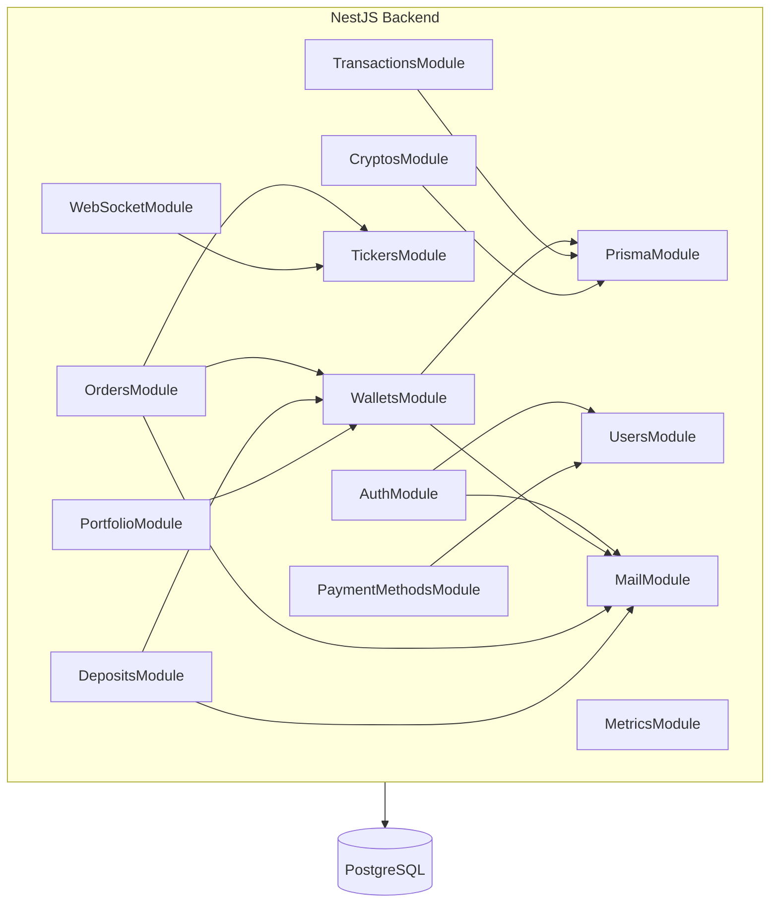
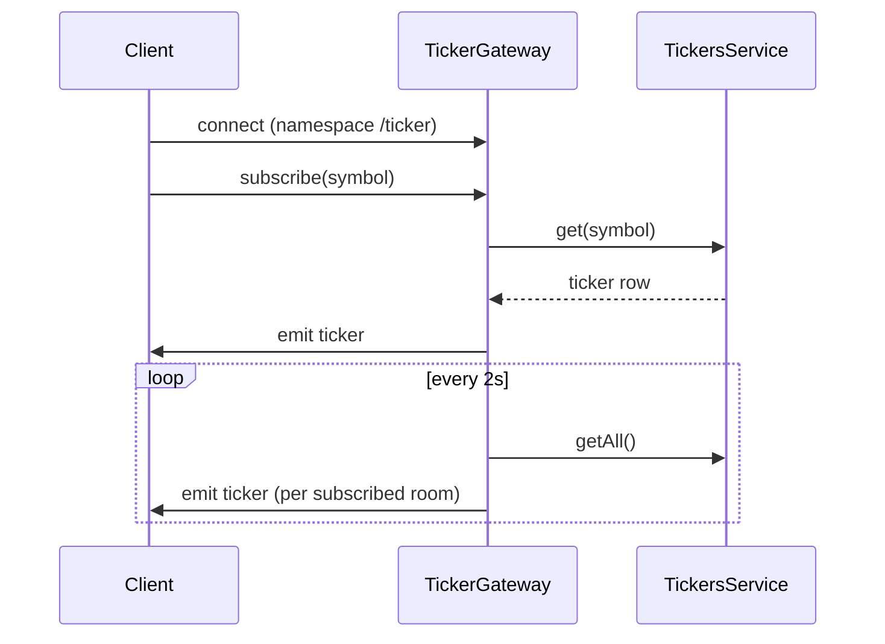

# CryptoSandboxQA — Architecture

A small crypto exchange training platform for QA practice. Simulate trades, validate transactions, and test automation in a safe environment.

## Repository layout

| Path | Role |
|------|------|
| `backend/` | NestJS API, Prisma schema & migrations, seeds; [`src/openapi/`](backend/src/openapi/) helpers and sample payloads for Swagger / `docs/openapi.json` |
| `frontend/` | Next.js (App Router) UI |
| `scripts/` | `setup`, database up/down/dump/restore helpers |
| `docs/` | Design notes ([API plan](docs/API_DESIGN_PLAN.md), [DB proposal](docs/DATABASE_DESIGN_PROPOSAL.md)), static `openapi.json`, [QA testing features](docs/QA_TESTING_FEATURES.md); see [README.md § Documentation](README.md#documentation) for the full doc index |
| `tests/ui-tests/` | Playwright tests; specs live under **`tests/ui-tests/tests/e2e/`** (journeys / flows) or **`tests/ui-tests/tests/unit/`** (narrow UI, e.g. validation matrices)—see [.cursor/rules/playwright-ui-tests.mdc](.cursor/rules/playwright-ui-tests.mdc) for tags vs folders; **`playwright.config.ts`** loads repo **root `.env`** then **`tests/ui-tests/.env`** (overrides); root `.env.example` has `API_URL` / `ADMIN_API_KEY`; **`tests/ui-tests/.env.example`** has **`PLAYWRIGHT_BASE_URL`** / optional seeds; **`src/services/`** holds REST clients (`*.api.ts`, e.g. `AuthApi`, `UserApi`); **`src/models/`** barrel (**`index.ts`**) re-exports domain types and **`user/TestUser`**, **`user/AdminUser`** (Playwright API actors); other domain folders are **`market/`**, **`balances/`**, **`trading/`**, **`payments/`**; strategies include `ApiUserCreationStrategy` and `AdminApiUserCreationStrategy` (`ADMIN_API_KEY`) |
| `tests/backend_tests/` | Python API test scaffolding (pytest-oriented); **`conftest.py`** (package root) sets **`pytest_plugins`** to load modules under **`src/plugins/`** (e.g. **`fxt_admin_user`** → **`AdminRegisteredTestUser`** via **`AdminApiUserCreationStrategy`**; **`fxt_regular_user`** → **`RegisteredTestUser`** via **`ApiUserCreationStrategy`**); **`src/models/user/`** holds dataclass shapes aligned with [`tests/ui-tests/src/models/user/user.types.ts`](tests/ui-tests/src/models/user/user.types.ts) (`UserProfile`, `UserWithProfile`, `UserWithProfileTestData`, `RegisteredTestUser`, **`AdminRegisteredTestUser`** for admin bootstrap, etc.); **`src/builders/`** holds **`UserBuilder`** (test payloads, aligned with [`tests/ui-tests/src/builders/user.builder.ts`](tests/ui-tests/src/builders/user.builder.ts)); **`src/services/base_client.py`** shared **`httpx`** **`BaseClient`** (URL resolution, client lifecycle; **`get`/`post`/`put`/`patch`/`delete`** delegate to **`_request`**, which applies **`raise_for_status_with_body`** + **`response.json()`** unless **`expected_failure`** returns the raw **`httpx.Response`**); **`src/services/auth_client.py`** **`AuthClient`** extends **`BaseClient`** for unauthenticated bootstrap: `POST /auth/register-with-profile` and `POST /auth/admin/register` (`registration_dict_from_test_data` matches `RegisterWithProfileDto`); **`src/services/user_client.py`** **`UserClient`** (Bearer JWT) and **`AdminClient`** (subclass of **`UserClient`**) add authenticated user vs admin-only HTTP helpers (aligned with **`UserApi`** / **`AdminApi`** in UI tests); factories **`user_client_from_registered`** / **`admin_client_from_registered`** build clients from registration results; **`RegisteredTestUser.api`** (lazy **`UserClient`**) / **`AdminRegisteredTestUser.api`** (lazy **`AdminClient`**), same as **`user_client_from_registered`** / **`admin_client_from_registered`**; **`src/strategies/user/`** holds **`UserCreationStrategy`**, **`ApiUserCreationStrategy`**, **`AdminApiUserCreationStrategy`** (same roles as Playwright; admin strategy subclasses API strategy and returns **`AdminRegisteredTestUser`**); **`src/factories/user_factory.py`** composes **`UserBuilder`** + strategy (strategy-first, like `user.factory.ts`); root **`.env`** / **`.env.example`** supply **`API_URL`** and **`ADMIN_API_KEY`** for the client; **`src/utils/env_loader.py`** loads repo root **`.env`** then optional **`tests/backend_tests/.env`** (overrides) using **`python-dotenv`** before clients read **`os.environ`**; **`pyproject.toml`** sets pytest **`pythonpath`** to **`src`** and declares **`httpx`**, **`python-dotenv`**, and **`pytest`** |
| Root `package.json` | npm workspaces; orchestrates `dev`, DB, OpenAPI generation |

---

## Tech stack

| Layer | Technology |
|-------|------------|
| Backend | NestJS (TypeScript), Prisma ORM |
| Database | PostgreSQL |
| Realtime | Socket.IO (`@nestjs/websockets`, namespace `/ticker`) |
| Frontend | Next.js (React), Zustand (where used), Socket.IO client, **@dnd-kit** (sortable drag-and-drop on dashboard Portfolio Analytics) |
| API docs | Swagger UI + OpenAPI JSON (`/api/docs`, `/api/docs-json`) |
| Metrics | `prom-client` — `GET /metrics` (Prometheus text format) |
| Tooling | npm workspaces, Docker Compose (Postgres + **Mailpit** for dev SMTP + optional observability stack) |

---

## Backend application

`AppModule` wires global `ConfigModule`, `PrismaModule`, and feature modules. **`ConfigModule` env files:** [`nestEnvFilePaths()`](backend/src/app.module.ts) loads the first existing paths among `process.cwd()` (usually `backend/` when using `npm run dev`) and `__dirname` (usually `backend/dist` when compiled)—`backend/.env` first, then the **repository root** `.env`. Later files override earlier keys. This ensures monorepo SMTP and DB settings in the root `.env` are not skipped. [`MailService`](backend/src/mail/mail.service.ts) (via **`MailModule`**) also falls back to `process.env.SMTP_HOST` / `SMTP_PORT` if needed.



### Feature modules (implemented)

| Module | Responsibility |
|--------|----------------|
| **MailModule** | Shared **nodemailer** delivery (`MailService`): password reset, **welcome** on `POST /auth/register` / `POST /auth/register-with-profile`, **order** status (open / filled / canceled + maker filled from matching), **fiat/crypto deposit** confirmations — same SMTP/Mailpit rules as reset |
| **AuthModule** | Register, register-with-profile, login, logout; **password reset** (`POST /auth/forgot-password` → email/logs **8-digit code**, `POST /auth/reset-password` with code); optional SMTP (`MailModule` / nodemailer; **Mailpit** in Compose); JWT + **session** records (`user_sessions`); **2FA** (TOTP setup, enable/disable, verify, backup codes); **admin** bootstrap via `ADMIN_API_KEY` (`POST /auth/admin/register`); **admin-only** `POST /auth/admin/create-user` and **multipart** `POST /auth/admin/bulk-import-users` (CSV/JSON, same columns as single create); **impersonation** (`POST /auth/impersonate`, `POST /auth/end-impersonation`) |
| **UsersModule** | Authenticated user profile CRUD, extended `UserProfile` fields; **admin** `GET /users/bulk/export` (presets: first 100 / last 100 by `createdAt`, or date range up to 500 rows; `format=json|csv`; no password hashes) |
| **WalletsModule** | Balances per asset (`user_balances`), training deposit/withdraw via service layer with `balance_transactions` audit; training **fiat/crypto credits** that create `deposits_fiat` / `deposits_crypto` rows send the same **deposit receipt** emails as `DepositsModule` (via `MailService`) |
| **OrdersModule** | Limit/market orders (**spot** and **futures** `marketType` in schema), cancel/list; **MatchingService** (FIFO-style matching, trades). Open orders **lock** funds in `user_balances.balance_locked` (sell: base qty; buy: quote ≈ qty × limit price, or **market buy**: qty × last price at submit, stored on `orders.price` for reservation math); **order_lock** / **order_unlock** in `balance_transactions`. Fills settle via locked funds (`WalletsService.settle*InTx`). |
| **TickersModule** | Last price + 24h volume per trading pair; initial seed on boot |
| **CryptosModule** | Read API for `cryptos` table (market listings / markets UI) |
| **DepositsModule** | **Fiat** and **crypto** deposit flows persisted to `deposits_fiat` / `deposits_crypto`, balance + `balance_transactions`; **deposit receipt** email via `MailService` after success |
| **PaymentMethodsModule** | User payment methods (`user_payment_methods`); used by fiat deposits |
| **PortfolioModule** | Authenticated portfolio: balances, summary, allocation |
| **TransactionsModule** | User-facing transaction history (aggregates deposits, trades, withdrawals as exposed by API) |
| **WebSocketModule** | **TickerGateway** — Socket.IO namespace `/ticker` |
| **MetricsModule** | `GET /metrics` for Prometheus |

**Simulated persistence delay (training):** After validation and **before** the first write, [`OrdersService.create`](backend/src/orders/orders.service.ts) and [`DepositsService`](backend/src/deposits/deposits.service.ts) fiat/crypto deposit methods await [`simulatedPersistDelay`](backend/src/common/simulated-persist-delay.ts) (default **1200** ms, env **`SIMULATED_PERSIST_DELAY_MS`**, `0` to disable). This mimics gateway/settlement lag before rows hit PostgreSQL.

### Admin HTTP API (JWT + admin role)

Admin controllers use the `admin/users` prefix and require an admin-authenticated session (see Swagger tags). Examples:

- `GET /admin/users/:userId/wallets`, wallets by asset
- `GET /admin/users/:userId/orders`, order detail
- `GET /admin/users/:userId/deposits/fiat|crypto` (+ by id)
- `GET /admin/users/:userId/payment-methods` (+ by id)
- `GET /admin/users/:userId/portfolio/*` (balances, summary, allocation)
- `GET /admin/users/:userId/transactions` (+ deposits / trades / withdrawals filters)
- `GET /users/bulk/export?preset=first100|last100|dateRange&from=&to=&format=json|csv` (same admin JWT session as other `/users` admin routes)

---

## Authentication & security (implemented)

- **JWT** bearer tokens for API access, combined with **SessionGuard** backed by `user_sessions` (logout invalidates session).
- **Roles**: `user` | `admin` on `users.role`; `AdminGuard` for admin-only routes.
- **Admin API key**: `ADMIN_API_KEY` + `AdminApiKeyGuard` for bootstrapping admin users (`POST /auth/admin/register`).
- **2FA**: `UserTwoFactor` model; login may return a temp token until `POST /auth/2fa/verify`.
- **Password reset**: `UserPasswordReset` rows (HMAC-hashed code, expiry, single use); successful reset clears all `user_sessions` for that user.
- **Impersonation**: Admin receives tokens to act as target user + `backToAdminToken` to revert (`POST /auth/end-impersonation`).

### Password reset & dev mail (detail)

| Item | Detail |
|------|--------|
| **User flow** | [`/forgot-password`](frontend/app/forgot-password/page.tsx) → `POST /auth/forgot-password` `{ email }` → user receives **8-digit** code (email or Mailpit) → [`/reset-password`](frontend/app/reset-password/page.tsx) → `POST /auth/reset-password` `{ email, code, newPassword }`. |
| **Anti-enumeration** | Same JSON message from forgot-password whether the email exists; **no email is sent** if there is no matching `users` row. |
| **Code storage** | Plain code is never stored; DB keeps `code_hash` = `HMAC-SHA256(pepper, code)` with `PASSWORD_RESET_CODE_PEPPER` or `JWT_SECRET`. Code TTL **30 minutes**; one row per pending reset per user (new request replaces unused rows). |
| **SMTP / Mailpit** | [Mailpit](https://mailpit.axllent.org/) is defined in [`docker-compose.yml`](docker-compose.yml) (`mailpit` service). Typical dev: **`SMTP_HOST=localhost`**, **`SMTP_PORT=1025`**, **`SMTP_SECURE=false`**. Web UI: **http://localhost:8025** (override host port with `MAILPIT_HTTP_PORT`). Backend startup logs that URL from [`main.ts`](backend/src/main.ts). |
| **No SMTP** | If `SMTP_HOST` is empty, [`MailService`](backend/src/mail/mail.service.ts) **logs** the full message (including the code) and does not open a socket—useful when Mailpit is not running. |
| **Other env** | See [`.env.example`](.env.example): `MAIL_FROM`, optional `SMTP_USER` / `SMTP_PASS`. |

### Transactional email (welcome, orders, deposits)

| Item | Detail |
|------|--------|
| **Welcome** | Sent after `AuthService.register` / `registerWithProfile` (not admin-only create paths). Errors are **logged**; registration still succeeds. |
| **Orders** | [`OrdersService`](backend/src/orders/orders.service.ts) notifies **open** / **filled** / **cancelled** after create (final state post-`matchOrder`), **cancel**, and **setStatus**. [`MatchingService`](backend/src/orders/matching.service.ts) emails the **maker** when their order becomes **filled** (taker notification comes from create’s end-state only, avoiding duplicate filled mail). |
| **Deposits** | [`DepositsService`](backend/src/deposits/deposits.service.ts) fiat/crypto; [`WalletsService.credit`](backend/src/wallets/wallets.service.ts) training paths that insert deposit rows. Errors **logged**; deposit still succeeds. |
| **Reset vs. rest** | **Password reset** still **throws** on SMTP failure when host is set (client sees error). Other mail types swallow delivery errors after logging. |

Manual / automation notes: [docs/QA_TESTING_FEATURES.md](docs/QA_TESTING_FEATURES.md) § *Transactional email*.

---

## Database (Prisma)

Full DDL lives in `backend/prisma/schema.prisma`. Detailed narrative: [docs/DATABASE_DESIGN_PROPOSAL.md](docs/DATABASE_DESIGN_PROPOSAL.md).

### Tables in active use

| Area | Models / tables |
|------|-----------------|
| Users & auth | `users`, `user_profiles`, `user_two_factor`, `user_sessions`, `user_password_resets` |
| Payments | `user_payment_methods` |
| Markets | `assets`, `trading_pairs`, `tickers`, `cryptos` |
| Balances | `user_balances`, `balance_transactions` |
| Trading | `orders`, `trades` |
| Funding | `deposits_fiat`, `deposits_crypto`, `withdrawals` |

Orders support `market_type` (`spot` | `futures`) and rich statuses (`open`, `partially_filled`, `filled`, `cancelled`, etc.) aligned with the Prisma schema.

---

## Key services (reference)

| Service | Module | Responsibility |
|---------|--------|----------------|
| **AuthService** | Auth | Credentials, JWT, registration with profile (triggers **welcome** email), admin user creation, impersonation, password reset codes |
| **MailService** | MailModule | Optional SMTP (password reset, welcome, order updates, deposit receipts); logs body when `SMTP_HOST` unset |
| **TwoFactorService** | Auth | 2FA lifecycle |
| **SessionsService** | Auth | Session persistence and revocation |
| **UsersService** | Users | User + profile persistence |
| **WalletsService** | Wallets | Balances, locks, training credits/debits, transaction log; **deposit receipt** email when training credit creates a deposit row |
| **OrdersService** | Orders | Order lifecycle, validation; triggers **order status** emails (to order owner) |
| **MatchingService** | Orders | Matching, trades, wallet updates; **maker filled** email when resting order fully fills |
| **TickersService** | Tickers | Ticker reads/updates, seed |
| **DepositsService** | Deposits | Fiat/crypto deposit records + balance updates; **deposit receipt** email |
| **PaymentMethodsService** | Payment methods | CRUD for saved methods |
| **PortfolioService** | Portfolio | Aggregated holder views |
| **TransactionsService** | Transactions | History endpoints |
| **TickerGateway** | WebSocket | Socket.IO subscribe/broadcast |

---

## Realtime: Socket.IO ticker



- **Namespace**: `/ticker` (see `TickerGateway`).
- **Client → server**: `subscribe` / `unsubscribe` messages with a symbol string (e.g. `BTC_USD`).
- **Server → client**: `ticker` payload `{ symbol, lastPrice, volume24h }`.
- Prices are driven from the database (simulated/training data), not external exchange feeds.

---

## Frontend (Next.js App Router)

### Routes implemented under `frontend/app/`

| Route | Purpose |
|-------|---------|
| `/` | Landing |
| `/login`, `/register`, `/forgot-password`, `/reset-password` | Auth |
| `/dashboard` | Wallets / trading overview |
| `/market` | Order book, place orders |
| `/history` | Order / activity history |
| `/deposit-cash`, `/deposit-crypto` | Deposit flows (API-backed where applicable) |
| `/buy-crypto` | Buy UI |
| `/calculate` | Calculator-style training UI |
| `/qa/iframe-practice` | Same-origin iframe with embedded form ([`frontend/public/qa/iframe-form.html`](frontend/public/qa/iframe-form.html) → `/qa/iframe-form.html`) for automation practice |
| `/trade/spot`, `/trade/futures` | Trade experiences |
| `/markets/prices`, `/markets/rankings/spot`, `/markets/trading-data/overview` | Markets discovery; tables wrap [`MarketsCryptoTable`](frontend/components/MarketsCryptoTable.tsx) (in **Suspense**) with QA modals — detail view (`?detail=SYMBOL`), about/methodology, reset confirm (`alertdialog`), nested stacked dialog — see [docs/QA_TESTING_FEATURES.md](docs/QA_TESTING_FEATURES.md) |
| `/profile`, `/profile/settings`, `/profile/portfolio` | Profile & portfolio |
| `/admin/import-users`, `/admin/impersonate` | Admin tooling UI |

Shared UI uses theme-aware Tailwind patterns (`group-data-[theme=light]`, emerald accent). See [.cursor/rules/ui-styles.mdc](.cursor/rules/ui-styles.mdc). **Submit feedback**: [`SubmitLoadingBar`](frontend/components/SubmitLoadingBar.tsx) (indeterminate bar + label) is used on buy/sell, fiat/crypto deposits, and trade order entry while `submitLoading` is true. [`awaitMinElapsedSince`](frontend/lib/submitLoadingMinDuration.ts) enforces a minimum ~3.5s visible loading state after fast API responses so the bar is noticeable in training.

**Dashboard Portfolio Analytics** ([`DashboardCharts`](frontend/components/DashboardCharts.tsx)): chart blocks are **reorderable** by dragging **anywhere on the card** (plus keyboard via @dnd-kit **Sortable**); **Shuffle blocks** shuffles visible cards; **Customize layout** reveals **remove** actions; **Add block** restores hidden cards. **Visible order** and **hidden ids** persist in **`sessionStorage`** keys `portfolio-analytics-block-order` and `portfolio-analytics-block-hidden` (per tab; legacy full-order-only values are migrated on read). QA selectors include `customize-analytics-layout`, `add-analytics-block-menu`, `add-analytics-block-<id>`, `remove-analytics-block-<id>`, `analytics-undo-remove`, `analytics-blocks-empty`, and existing chart `data-testid`s.

**API client**: `frontend/lib/api.ts` (REST to `NEXT_PUBLIC_API_URL`). Live prices use Socket.IO to the backend.

**Client-side validation** (inline errors before submit, aligned with Nest DTOs where applicable): [`frontend/lib/authFieldConstraints.ts`](frontend/lib/authFieldConstraints.ts), [`frontend/lib/searchFieldConstraints.ts`](frontend/lib/searchFieldConstraints.ts), [`frontend/lib/trainingDepositConstraints.ts`](frontend/lib/trainingDepositConstraints.ts). Shared **API** limits for the same fields: [`backend/src/common/validation.constants.ts`](backend/src/common/validation.constants.ts) (`EMAIL_MAX_LENGTH`, `WALLET_DEPOSIT_AMOUNT_MAX` on `DepositDto`). Rules, `data-testid`s, and positive/negative scenarios are documented in [docs/QA_TESTING_FEATURES.md](docs/QA_TESTING_FEATURES.md) (*Input field rules and restrictions*).

---

## Observability & ops

- **Swagger**: served at `/api/docs` after backend start; OpenAPI JSON at `/api/docs-json`.
- **Static spec**: [docs/openapi.json](docs/openapi.json) for offline tools; regenerate via `npm run openapi:generate` from repo root. Response **examples** (JSON/text) are maintained in [`backend/src/openapi/`](backend/src/openapi/) (`api-json-example.decorator.ts`, `response-examples.ts`) and emitted into the generated spec.
- **Prometheus**: `GET /metrics` on the API port.
- **Compose**: `npm run stack:up` — backend + Postgres + Prometheus + Grafana (see [README.md](README.md)).

---

## UI conventions (branding)

Use consistent emerald branding for primary/secondary actions (buttons, dropdowns, table controls):

```
rounded-lg px-4 py-2 text-sm font-medium transition-colors border-0 outline-none focus:outline-none
bg-emerald-500/10 text-emerald-400 hover:bg-emerald-500/20 hover:text-emerald-300
group-data-[theme=light]:bg-emerald-50 group-data-[theme=light]:text-emerald-700
group-data-[theme=light]:hover:bg-emerald-100 group-data-[theme=light]:hover:text-emerald-800
```

Compact controls: `px-3 py-1.5` instead of `px-4 py-2`.

---

## QA scenarios (high level)

Dedicated UI / automation practice surfaces are catalogued in [docs/QA_TESTING_FEATURES.md](docs/QA_TESTING_FEATURES.md).

1. **Auth**: Register → login (optional **welcome** mail in Mailpit/logs) → optional 2FA → logout (session invalid); forgot password → **8-digit code** (email or Mailpit / logs) → reset password → login.
2. **Admin**: Create admin via API key → impersonate user → end impersonation.
3. **Wallets / deposits**: Fiat or crypto deposit → verify `user_balances`, history endpoints, and optional **deposit receipt** in Mailpit/logs.
4. **Orders**: Limit/market on spot (and futures UI where wired) → fill or cancel → inspect trades; optional **order status** mail per transition (see [QA_TESTING_FEATURES](docs/QA_TESTING_FEATURES.md)).
5. **Realtime**: Socket.IO `/ticker` → subscribe → assert `ticker` events.
6. **Observability**: Hit `/metrics`, confirm Grafana/Prometheus in stack profile.
7. **Iframe forms**: Open `/qa/iframe-practice`, scope automation to the iframe, fill fields with `data-testid` / labels, submit, assert in-frame success.

---

## Keeping this document current

When you change stack modules, major routes, database models, or auth behavior, update this file in the same PR so it stays the single overview for humans and agents. See [.cursor/rules/project-conventions.mdc](.cursor/rules/project-conventions.mdc).
