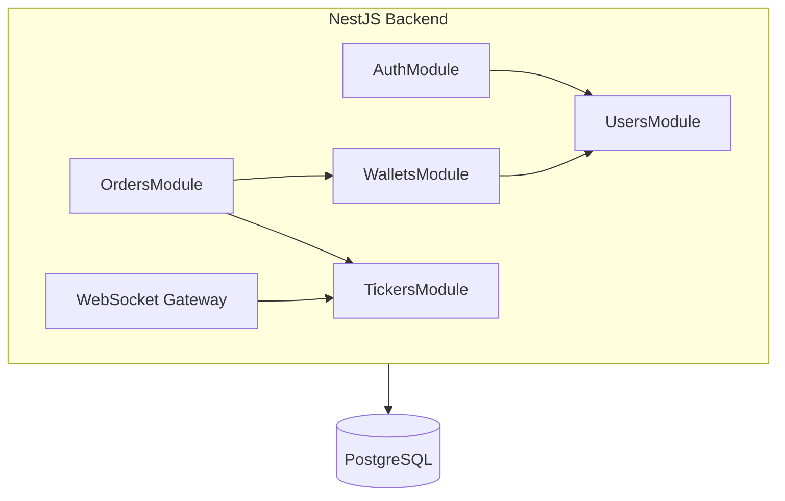
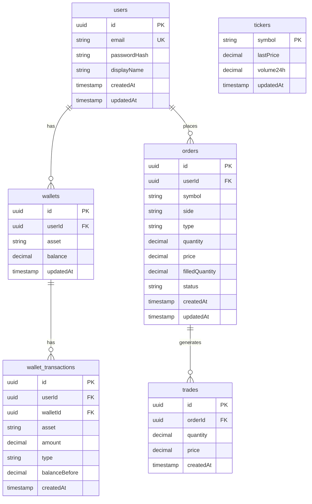
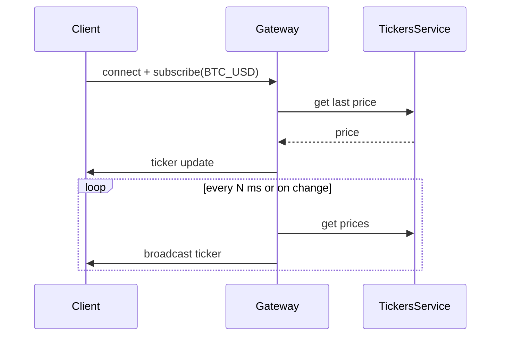

# CryptoSandboxQA — Architecture

A small crypto exchange training platform for QA practice. Simulate trades, validate transactions, and test automation on a safe environment.

## Tech Stack

| Layer | Technology |
|-------|------------|
| Backend | NestJS (TypeScript) |
| Frontend | Next.js (React) |
| Database | PostgreSQL |
| Realtime | WebSocket |

---

## Backend Modules

| Module | Responsibility |
|--------|----------------|
| **AuthModule** | Register, login (JWT), password hashing (bcrypt), guards for protected routes |
| **UsersModule** | User profile CRUD (id, email, displayName) |
| **WalletsModule** | Per-user wallets: balance per asset (USD, BTC, ETH). Deposit/withdraw for training |
| **OrdersModule** | Create/cancel/list orders (limit/market). Simple order matching |
| **TickersModule** | Last price + 24h stats per symbol. Feeds WebSocket |
| **WebSocketModule** | Broadcasts price updates. Clients subscribe by symbol |

---

## Database Tables

- **users**: id, email (unique), passwordHash, displayName, createdAt, updatedAt
- **wallets**: id, userId (FK), asset (USD/BTC/ETH), balance. Unique (userId, asset)
- **wallet_transactions**: id, userId, walletId (FK), asset, amount (positive=deposit, negative=withdraw), type (deposit/withdraw), balanceBefore, createdAt — audit trail for deposits/withdrawals
- **orders**: id, userId, symbol (e.g. BTC_USD), side (buy/sell), type (limit/market), quantity, price, filledQuantity, status (open/filled/cancelled), createdAt, updatedAt
- **trades**: id, orderId, quantity, price, createdAt
- **tickers**: symbol (PK), lastPrice, volume24h, updatedAt (optional; can be in-memory)

---

## Services

| Service | Module | Responsibility |
|---------|--------|----------------|
| **AuthService** | AuthModule | Hash password, validate credentials, issue JWT |
| **UsersService** | UsersModule | Create user, find by id/email, update profile |
| **WalletsService** | WalletsModule | Get/create wallet, credit/debit balance |
| **OrdersService** | OrdersModule | Create order, cancel, list. Validates balance and calls matching |
| **MatchingService** | OrdersModule | Match orders (FIFO), create trades, update wallets |
| **TickersService** | TickersModule | Get/set last price per symbol. Used by WebSocket |
| **WebSocketGateway** | WebSocketModule | Broadcast ticker updates when client subscribes by symbol |

---

## WebSocket Flow

- Client connects and sends `subscribe: "BTC_USD"` (or similar).
- Server emits `ticker` events with `{ symbol, lastPrice, volume24h }`.
- Prices are mock/simulated (no external APIs).

---

## Frontend Structure

- **App Router** pages: `/login`, `/register`, `/dashboard` (wallets + open orders), `/market` (order book + place order), `/history`.
- **API client**: REST for auth and orders; WebSocket for live prices.
- **State**: React state or Zustand for user, wallets, live ticker.

---

## QA Scenarios

1. **Auth**: Register → Login → Logout.
2. **Wallets**: Deposit USD → Verify balance.
3. **Orders**: Place limit buy → Check order status → Fill (or cancel).
4. **Realtime**: Connect WebSocket → Subscribe to symbol → Assert ticker updates.
