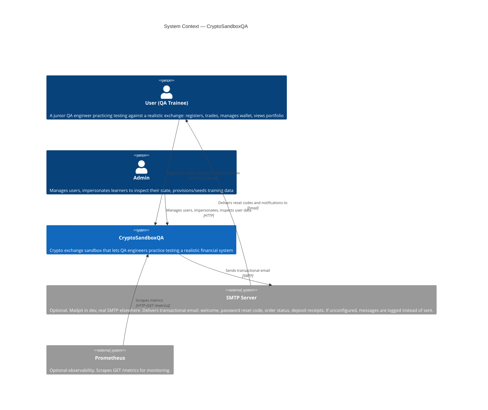

# C4 Context — CryptoSandboxQA

**Slug:** `C4-Context`
**Status:** Draft
**Source:** `ARCHITECTURE.md`, `SYSTEM-VISION.md` (as of 2026-07-25)

System Context diagram (C4 level 1): CryptoSandboxQA as a single system box,
its users, and the external systems it talks to. Frontend and backend are
both containers of this one system at this zoom level — container-level
detail (NestJS backend, Next.js frontend, PostgreSQL as separate boxes)
belongs in a future C4 Container diagram, not here.

Rendered in Mermaid `C4Context`. `ARCHITECTURE.md` does not itself contain a
`C4Context` diagram (its existing diagrams are `flowchart` and
`sequenceDiagram`) — Mermaid is used here because it's text-based and
versions with the repo, per `references/c4-guidelines.md`'s default; no
claim of prior-art consistency is made.

## Legend

- **Person** — a human actor interacting with the system directly.
- **System** — CryptoSandboxQA itself, treated as one box at this zoom level.
- **System_Ext** — external systems CryptoSandboxQA depends on or is
  observed by; neither is part of CryptoSandboxQA.
- Arrow direction follows who initiates the interaction (e.g. Prometheus
  *pulls* from CryptoSandboxQA via scrape, so the arrow points from
  Prometheus into the system, not the reverse).
- **Explicitly not external systems** (per source, not inferred from
  absence): live price data comes from the database, not an external
  exchange feed — "Prices are driven from the database (simulated/training
  data), not external exchange feeds" (`ARCHITECTURE.md` § Realtime: Socket.IO
  ticker). There is no blockchain integration — "no blockchain integration,
  no real money movement" (`SYSTEM-VISION.md` § What it deliberately is not).
- **Grafana** is deliberately not modeled as a system in this diagram: it
  queries Prometheus, not CryptoSandboxQA directly, so it has no relationship
  to the system in scope at this boundary (`ARCHITECTURE.md` documents only
  Prometheus scraping `/metrics`; Grafana appears solely as a Compose
  service). It remains part of the observability stack described in
  `SYSTEM-OVERVIEW.md`.

## Open questions

- [ ] Whether `Rel(learner, sandbox, ...)` and `Rel(admin, sandbox, ...)`
      should be labeled `HTTP` or `HTTPS` depends on deployment target, which
      is undocumented here — `ARCHITECTURE.md`/`CLAUDE.md` only describe
      local dev (`localhost:3000`/`3001`, no TLS mentioned). Labeled `HTTP`
      pending a documented deployment assumption. — owner: mmizin

## Related

- [`SYSTEM-VISION.md`](SYSTEM-VISION.md) — defines the primary (QA trainee)
  and secondary (training lead / provisioner) actors this diagram's `Person`
  elements are drawn from
- [`SYSTEM-OVERVIEW.md`](SYSTEM-OVERVIEW.md) — narrative detail on the
  components inside the CryptoSandboxQA box
- [`ARCHITECTURE.md`](../../ARCHITECTURE.md) § Backend application — module
  diagram, one level of detail below this one (candidate input for a future
  C4 Container diagram)
