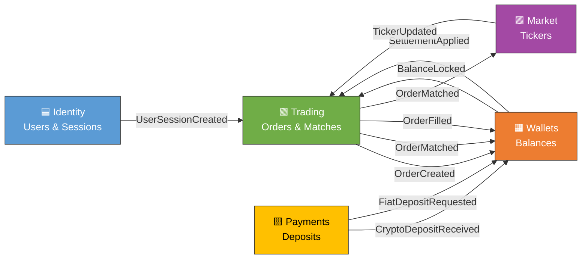

# Event Storming Lite — CryptoSandboxQA

**Date:** 2026-06-07  
**Repo:** CryptoSandboxQA (production crypto exchange sandbox)

---

## 12 Key Events (Past Tense)

1. **UserRegistered** — User creates account with email + password
2. **UserSessionCreated** — User logs in, receives JWT token
3. **PasswordResetRequested** — User initiates password reset flow
4. **OrderCreated** — User places limit/market/stop order
5. **OrderMatched** — Incoming order matches resting order (FIFO)
6. **OrderFilled** — Order fully executed at agreed price
7. **OrderCanceled** — User or system cancels open order
8. **FiatDepositRequested** — User initiates fiat deposit (USD/EUR card/SEPA)
9. **CryptoDepositReceived** — Blockchain detects incoming crypto transaction
10. **BalanceLocked** — Funds reserved for pending order (sell qty or buy value)
11. **WalletFunded** — Deposit settled, balance credited
12. **TickerUpdated** — Market price changed, broadcast to subscribed clients

---

## Bounded Context Candidates (5 contexts)

### 🟦 **Identity**
**Responsibility:** User registration, authentication, session management, password recovery.  
**Modules:** AuthModule, UsersModule

**Ubiquitous Language:**
- **User** — authenticated account with email, password hash, role (user|admin)
- **Session** — signed JWT token + server-side session record for logout revocation
- **Credentials** — email + password pair for login
- **RefreshToken** — (future) long-lived token to issue new JWTs
- **PasswordReset** — HMAC-hashed code with 30-min TTL for reset flow

**Events:**
- UserRegistered
- UserSessionCreated
- PasswordResetRequested

---

### 🟩 **Trading**
**Responsibility:** Order lifecycle (creation, matching, fills, cancellations), trade execution, FIFO order book.  
**Modules:** OrdersModule, MatchingService, TickerModule (price feed)

**Ubiquitous Language:**
- **Order** — buy/sell limit/market/stop order on a trading pair (spot or futures)
- **Matching** — FIFO price-time priority algorithm pairing taker with resting makers
- **Trade** — executed fill record from matching (taker + maker + price + qty)
- **ExecutionPrice** — price at which order or portion thereof fills (limit price or last price for market)
- **StopOrder** — limit order that activates when price ≥ (buy) or ≤ (sell) stop price

**Events:**
- OrderCreated
- OrderMatched
- OrderFilled
- OrderCanceled

---

### 🟨 **Payments**
**Responsibility:** Fiat and crypto deposit intake, payment method persistence, deposit receipts.  
**Modules:** DepositsModule, PaymentMethodsModule, MailService (receipts)

**Ubiquitous Language:**
- **Deposit** — fiat (card/SEPA) or crypto (blockchain) funding transaction
- **PaymentMethod** — saved card/bank/wallet linked to user for fiat deposits
- **DepositReceipt** — confirmation email sent after deposit settles
- **Asset** — USD, EUR, BTC, ETH (symbol + type: fiat|crypto)
- **DepositStatus** — pending → confirmed → settled (on-chain confirmation or card processing)

**Events:**
- FiatDepositRequested
- CryptoDepositReceived

---

### 🟧 **Wallets**
**Responsibility:** Balance management, fund locking/unlocking, internal transfers, withdrawal flows, settlement ledger.  
**Modules:** WalletsModule, TransactionsModule

**Ubiquitous Language:**
- **Balance** — available funds per asset per user
- **BalanceLocked** — amount reserved for open orders (prevents double-spend)
- **Wallet** — per-user, per-asset balance record
- **Settlement** — atomic debit/credit pair moving locked funds to available (order fill)
- **TransactionRecord** — audit log entry (order_lock, order_unlock, order_fill, transfer, deposit, withdrawal)

**Events:**
- BalanceLocked
- WalletFunded
- (implicit: BalanceUnlocked on cancel, SettlementApplied on fill)

---

### 🟪 **Market**
**Responsibility:** Real-time ticker distribution, price aggregation, trading-pair metadata.  
**Modules:** TickersModule, WebSocketModule (TickerGateway), CryptosModule

**Ubiquitous Language:**
- **Ticker** — current market snapshot per trading pair
- **LastPrice** — most recent execution price
- **Volume24h** — total traded volume in 24-hour window
- **TradingPair** — symbol pair (BTC_USD, ETH_EUR)
- **PriceSubscription** — client subscription to real-time ticker updates via Socket.IO `/ticker` namespace

**Events:**
- TickerUpdated

---

## Bounded Context Map (Mermaid)

---

## Inter-BC Communication (Event-Driven Flows)

| Source Event | From BC | Target BC | Action | Via |
|---|---|---|---|---|
| `UserSessionCreated` | Identity | Trading | User can place orders | JWT in request |
| `OrderCreated` | Trading | Wallets | Lock balance for order | WalletsService.lock() |
| `OrderMatched` | Trading | Wallets | Settle matched trade | WalletsService.settle*InTx() |
| `OrderFilled` | Trading | Wallets | Finalize fill, unlock excess | SettlementService |
| `FiatDepositRequested` | Payments | Wallets | Queue balance update | DepositsService → WalletsService.credit() |
| `CryptoDepositReceived` | Payments | Wallets | Credit on-chain confirmation | DepositsService → WalletsService.credit() |
| `TickerUpdated` | Market | Trading | Check stop-order triggers (frontend) | Socket.IO broadcast |
| `OrderCanceled` | Trading | Wallets | Unlock reserved balance | WalletsService.unlock() |

---

## Notes

- **Async messaging:** Currently synchronous NestJS service calls. Event sourcing / message queue (RabbitMQ, Kafka) optional for high-volume future.
- **Stop orders:** Frontend-driven trigger (polling ticker prices); may move to backend async eventually.
- **Admin operations (impersonation, bulk import):** Inherit Identity context; no new event type needed yet.
- **Portfolio aggregation:** Queries Wallets BC; read model, no new events.
- **Simulated persistence delay:** Training UX; part of Trading/Payments order semantics, not a separate event.

